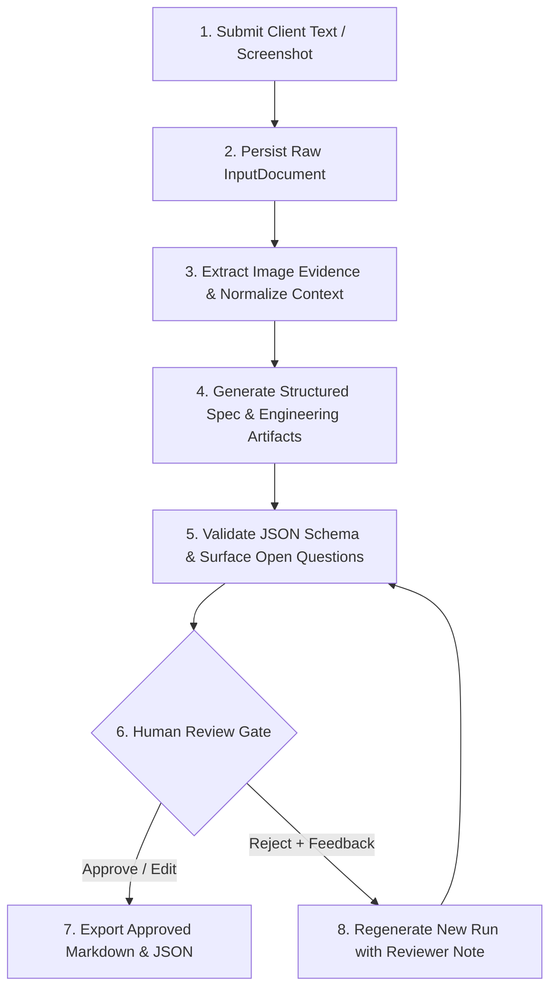
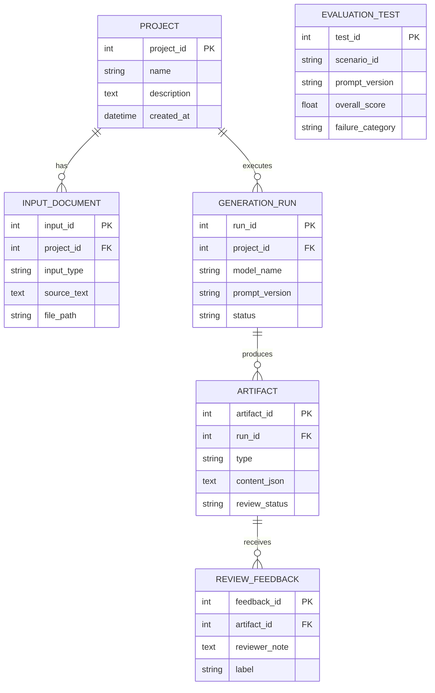

# MoinSystems AI DevFlow Copilot — Architecture & Data Model

## 1. System Architecture Diagram

```mermaid
flowchart LR
    User[Software House User<br/>PM / BA / Dev / QA] --> UI[Streamlit MVP UI<br/>Input + Review Gate + Eval Dashboard]
    UI -->|REST / Multipart| API[FastAPI Backend<br/>Validation + Orchestration]
    API --> Vision[Local Vision Adapter<br/>Ollama + qwen2.5vl:3b]
    API --> LLM[Local Spec & Artifact Adapter<br/>Ollama + qwen3:4b]
    Vision --> Norm[Normalized Context Builder<br/>Observed vs Assumed]
    Norm --> LLM
    LLM --> Val[Pydantic Schema Guardrails]
    Val --> DB[(SQLite Local DB<br/>devflow.db)]
    DB --> Export[Gated Export<br/>Markdown + JSON]
```

## 2. End-to-End Human-in-the-Loop Workflow

```mermaid
flowchart TD
    A[1. Submit Client Text / Screenshot] --> B[2. Persist Raw InputDocument]
    B --> C[3. Extract Image Evidence & Normalize Context]
    C --> D[4. Generate Structured Spec & Engineering Artifacts]
    D --> E[5. Validate JSON Schema & Surface Open Questions]
    E --> F{6. Human Review Gate}
    F -->|Approve / Edit| G[7. Export Approved Markdown & JSON]
    F -->|Reject + Feedback| H[8. Regenerate New Run with Reviewer Note]
    H --> E
```

## 3. Entity Relationship Diagram (ERD)

```mermaid
erDiagram
    PROJECT ||--o{ INPUT_DOCUMENT : has
    PROJECT ||--o{ GENERATION_RUN : executes
    GENERATION_RUN ||--o{ ARTIFACT : produces
    ARTIFACT ||--o{ REVIEW_FEEDBACK : receives

    PROJECT {
        int project_id PK
        string name
        text description
        datetime created_at
    }
    INPUT_DOCUMENT {
        int input_id PK
        int project_id FK
        string input_type
        text source_text
        string file_path
    }
    GENERATION_RUN {
        int run_id PK
        int project_id FK
        string model_name
        string prompt_version
        string status
    }
    ARTIFACT {
        int artifact_id PK
        int run_id FK
        string type
        text content_json
        string review_status
    }
    REVIEW_FEEDBACK {
        int feedback_id PK
        int artifact_id FK
        text reviewer_note
        string label
    }
    EVALUATION_TEST {
        int test_id PK
        string scenario_id
        string prompt_version
        float overall_score
        string failure_category
    }
```